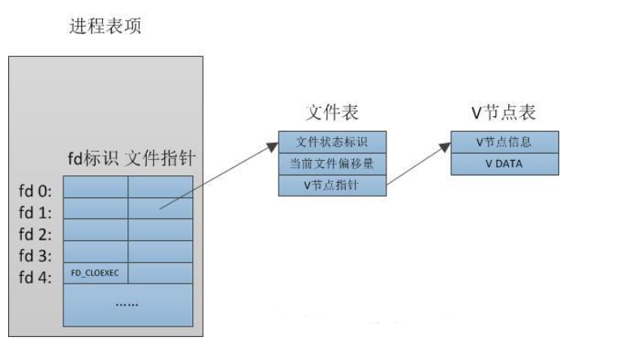
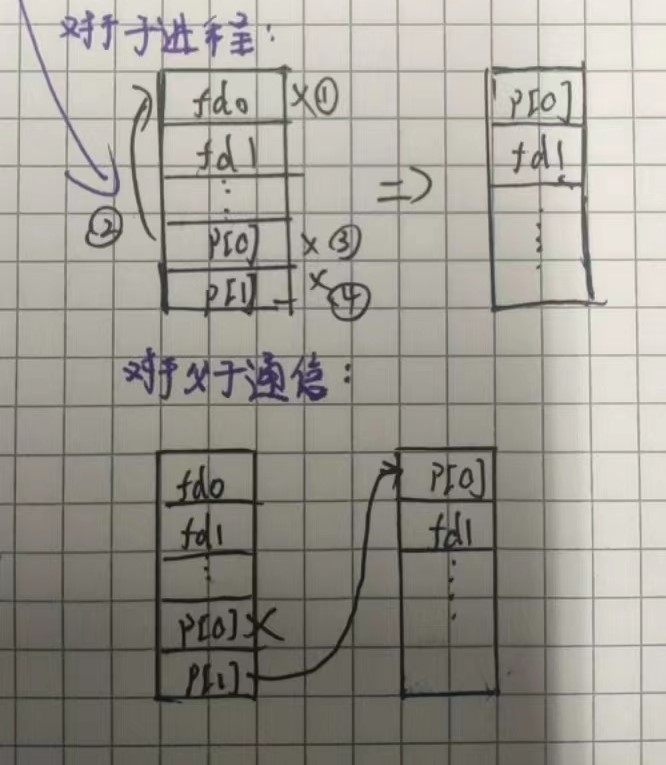

# 讲义笔记
## 一. 进程和内存
1. 进程通过系统调用进入内核，一个进程在用户空间和内核空间之间交替执行。
2. fork创建新进程，在父进程中，fork返回子进程的PID；在子进程中，fork返回零
3. exit使调用进程停止执行并释放资源。exit(0)表示成功，exit(1)表示失败。
4. wait阻塞等待子进程的退出并返回退出子进程的PID，同时将退出状态传递给调用wait的地址；如果调用者没有子进程，wait立即返回-1。如果父进程不关心子进程的退出状态，它可以传递一个0地址给wait(如：pid = wait((int *) 0);)。
5. 尽管最初子进程与父进程有着相同的内存内容，但是二者在运行中拥有不同的内存空间和寄存器。
6. exec进行进程替换。本身并不创建新进程，所以前后进程的ID并没有改变。exex执行成功就退出进程，否则执行后面的代码。

## 二. I/O和文件描述符
1. 文件描述符是一个整数，它代表了一个进程可以读写的被内核管理的对象。每个进程都有一张表，而 xv6 内核就以文件描述符作为这张表的索引，所以每个进程都有一个从0开始的文件描述符空间。见下图

2. read(fd，buf，n)从文件描述符fd读取最多n字节，将它们复制到buf，并返回读取的字节数。read从当前文件偏移量开始读取数据。
3. write(fd，buf，n)将buf中的n字节写入文件描述符fd，并返回写入的字节数。只有发生错误时才会写入小于n字节的数据。与读一样，write在当前文件偏移量处写入数据，然后将该偏移量向前推进写入的字节数：每个write从上一个偏移量停止的地方开始写入。
4. read和write即是cat的实现原理：文件描述符0和1的使用
```C++
// cat.c
char buf[512];
int n;
for (;;) {
    n = read(0, buf, sizeof buf);
    if (n == 0)
        break;
    if (n < 0) {
        fprintf(2, "read error\n");
        exit(1);
    }
    if (write(1, buf, n) != n) {
        fprintf(2, "write error\n");
        exit(1);
    }
}
```
5. close系统调用释放一个文件描述符
6. cat重定向实现原理
```C++
char* argv[2];
argv[0] = "cat";
argv[1] = 0;
if (fork() == 0) {
    // 在子进程中，关闭标准输入0(即无法再从键盘获取数据)
    close(0);
    // open函数会将input.txt和标准输入绑定（最小的未使用的fd）
    open("input.txt", O_RDONLY);
    // 在环境变量中寻找cat文件，然后将argv作为参数传递进去
    exec("cat", argv);
}
```
总结：fork子进程，关闭fd0，open一个新的占据最小未使用的fd0，在使用exec重新调用即可完成重定向(其他的重定向也一样)。

7. fork复制了文件描述符表，但是每个基础文件偏移量在父文件和子文件之间是共享的。比如：
```C++
// 父子进程分别往同一个fd里面写入数据，但共享文件偏移量，因此不会进行覆盖，输出的仍然是"hello world"
if (fork() == 0) {
    write(1, "hello ", 6);
    exit(0);
} else {
    wait(0);
    write(1, "world\n", 6);
}
```
8. dup复制一个现有的文件描述符(引用),绑定到最小未使用的fd上并返回。两个文件描述符共享一个偏移量。
```C++
// fd和1是同一个文件描述符，因此最终结果也是"hello world"
fd = dup(1);
write(1, "hello ", 6);
write(fd, "world\n", 6);
```

## 三. 管道
1. 管道是一个小的内核缓冲区。并通过以下代码实现了grep fork sh.c | wc -l
```C++
int p[2];
char *argv[2];
argv[0] = "wc";
argv[1] = 0;
pipe(p);
if (fork() == 0) {
    close(0);
    dup(p[0]);
    close(p[0]);
    close(p[1]);
    exec("/bin/wc", argv);
} else {
    close(p[0]);
    write(p[1], "hello world\n", 12);
    close(p[1]);
}
```
关闭读写端0，然后复制p[0]绑定到fd0上面去。之后关闭管道，就实现了管道IO重定向。同时read是一个阻塞函数，因此在grep fork sh.c | wc -l上，只有等管道|左边的命令执行完毕了，才能通过管道将结果送入右边。


2.管道与临时文件，即
```shell
echo hello world | wc
```
与
```shell
echo hello world > /tmp/xyz; wc < /tmp/xyz
```
两者区别在于

第一：管道会自动清理；而文件重定向时创建的文件必须小心删除

第二：管道可以任意传递长的数据流，而文件重定向需要磁盘上足够的空闲空间。

第三：管道允许并行，而文件方法要求同步完成。

第四：如果实现进程间通讯，管道的阻塞式读写比文件的非阻塞语义更高效。

## 四. 文件系统
Xv6的目录是以树的形式存在，"/"表示根目录。
```C++
mknod("/console", 1, 1);
```
mknod创建一个设备文件(像dev下面那些一样)，设备文件通常设计字符设备文件(键盘，鼠标之类的)和块设备文件(硬盘之类的)。。待补充
1. 文件
一个文件(叫做inode,索引结点)可以有多个名字(link,链接)。inode保存有关文件的元数据，包括其类型(文件/目录/设备)、长度、文件内容在磁盘上的位置以及指向文件的链接数。
2. fstat从文件描述符所引用的inode中检索信息。它填充一个stat类型的结构体
```C++
#define T_DIR 1    // Directory
#define T_FILE 2   // File
#define T_DEVICE 3 // Device
struct stat {
    int dev;     // 文件系统的磁盘设备
    uint ino;    // Inode编号
    short type;  // 文件类型
    short nlink; // 指向文件的链接数
    uint64 size; // 文件字节数
};
```
3. link创建另一个文件名，该文件名与现有文件指向相同的inode
```C++
// O_CREATE | O_WRONLY进行or运算获得二进制码，以此二进制码进行操作
open("a", O_CREATE | O_WRONLY);
// 将b建立硬链接，其对象为a的硬链接对象
link("a", "b");
// 删除名称"a"
unlink("a");
```
4. 创建临时inode
```C++
// 该临时inode将在进程关闭fd或退出时被清理
fd = open("/tmp/xyz", O_CREATE | O_RDWR);
unlink("/tmp/xyz");
```


# 课程笔记
1. 系统调用，会跳到Kernel，Kernel可以获取到系统调用的参数，执行一些Kernel代码，与普通调用的区别在于权限更高，能直接操作硬件。
2. 父子进程共享的资源和状态包括
   1. 文件描述符表单

   2. 代码段

   3. 全局变量和静态变量

   4. 打开的共享内存和消息队列
  
   总结来说，父进程与内存相关的内存镜像都会拷贝一份给子进程。
3. XV6运行在一个RISC-V微处理器上
4. 字节流：每个read读取100个字节，第一次read会读取前100个字节，第二次读取101-200个字节，第三次读取201-300个字节，这就是我的意思。（字节流就是一段连续的数据按照字节的长度读取）
5. 文件描述符：本质就是一个哈希key，每个进程会维护一个自己的文件描述符表单，通过这个key找到对应的资源。同时，不同进程，即使拥有相同的文件描述符，可能对应的也是不同资源。
6. 高级语言的本质：高级语言对底层系统调用提供了更好的封装，但本质一样的，最终调用也会走到系统调用来。
7. shell：除了执行命令外， 还可以进行重定向，比如
```shell
// 将ls结果输出到out文档中
ls > out
// 将out文档中含有x的文件名输出
grep x < out
```
8. 系统调用如何编译：当你运行C语言并执行例如open系统调用时，虽然open是一个C函数，但是这个函数内的指令实际上是机器指令，也就是说我们调用的open函数是由汇编语言实现，在RISC-V中被称为ecall（将控制权转给内核，之后内核检查进程的内存和寄存器，并确定相应的参数。）
9. exec：exec会保留当前的文件描述符表单，同时exec通常不会返回（除了出错时），因为exec会完全替换当前进程的内存。
```C++
// exec.c: replace a process with an executable file
#include“kernel/types.h"
#include“user/user.h"
intmain()
// C是一个非常低阶（接近机器语言）的编程语言，并没有一个方法来确定一个数组究竟有多长。所以为了告诉内核数组的结尾在哪，我们将0作为最后一个指针
char *argv[] ={"echo","this",“is"，"echo"，0 };exec("echo"，argv);
printf("exec failed!\n");
exit(0);
```
10. fork与exec的组合妙用：exec会替换当前程序，但我们并不像覆盖当前主程序，因此最好的方法便是fork一个出来，然后执行exec即可。
```C
#include"user/user.h"
// forkexec.c: fork then exec
int main()
{
    int pid, status;
    pid = fork();
    if(pid == 0){
        char *argv[] ={"echo"，"THIS"，"IS"，"ECHO"，0};
        exec("echo"，argv);// 一般走到这里就会覆盖，不会执行下面代码
        printf("exec failed!\n");
        exit(1);// 返回值（1）传给父进程
        }
    else {
        printf("parent waiting\n");
        // 注意：这里wait只会等待一个子进程结束（收到返回值就结束），因此，对于多个子进程，需要多个wait
        wait(&status);//父进程阻塞等待，并将子进程exit返回的值（1）传入status
        printf("the child exited with status %d\n", status);
    }
    exit(0);
}
```
11. fork/exec组合的问题：fork会进行父进程的拷贝，而exec又将其覆盖了，相当于拷贝的东西没有用，这在大型程序运行时十分耗时和浪费。
   
    改进：使用copy on write fork，可以构建一个fork，对于内存实行lazy拷贝(*待补充*)
12. IO重定向：
    ```shell
    echo hello > out
    cat < out
    ```
    Shell首先fork，在子进程中，将文件描述符1改为output文件，之后再运行你的指令。是Unix中的常见的用来重定向指令的输入输出的方法。其本质如下所示：
    ```C++
    // redirect.c: run a command with output redirected
    int main()
    {
    int pid;
    pid = fork();
    if(pid ==0)
    {
        close(1);
        open("output.txt"，0_WRONLY|0_CREATE);
        char *argv[] = { "echo","this"，"is"，"redirected"，"echo"，0 };
        exec("echo"，argv);
        printf("exec failed!\n");
        exit(1);
    }else{
        wait((int *) 0);
        exit(0);
    }
    }
    ```