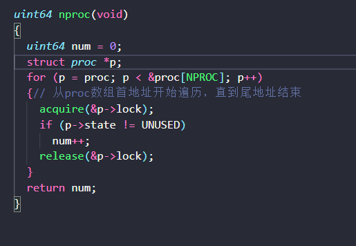
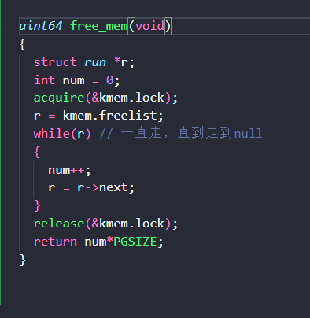
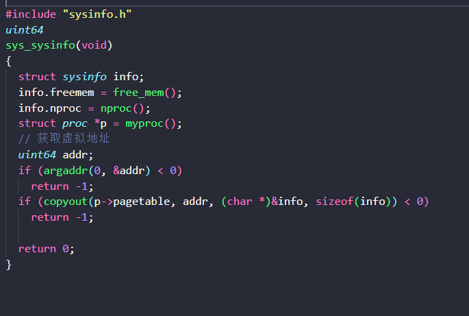
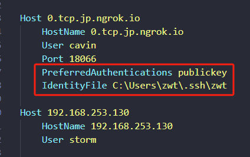

# 操作系统架构
## 抽象与隔离
### 软件对于强隔离的支持
系统调用：通过接口抽象硬件资源让程序不能对硬件直接操作，从而实现强隔离。（比如：进程抽象了CPU，files命令抽象了磁盘等。CPU每个核对应一个进程）
### 硬件对于强隔离的支持

#### user/kernel mode
CPU设置两种不同权限级别的运行模式，从而对于敏感资源进行保护和隔离（处理器通过设置一个flag，从而定义当前命令是user mode还是kernel mode进行执行）

每个进程都有一个执行线程（或简称线程）来执行进程的指令。一个线程可以挂起并且稍后再恢复

每个线程有两个栈区，一个user的stack，一个kernel的stack：p->kstac。两者相互独立，执行与操作互不影响。

在RISC-V中，通过ECALL指令，将程序执行控制权转移到内核。执行ECALL指令时，需要传入一个数字，其代表了应用程序想要调用的System Call。之后调用sret指令返回用户空间。整体过程如下

例子：用户态执行系统调用write，write函数并不能直接调用内核中的write代码，而是执行ECALL指令，之后控制权到了syscall函数，syscall会实际调用write系统调用。

#### 虚拟内存
每个进程都会有自己独立而特有的page table进行内存映射。从而实现内存隔离。

## 宏内核和微内核
xv6内核为每个进程维护许多状态片段，并将它们聚集到一个proc结构体中kernel/proc.h

Monolithic Kernel Design（宏内核）：所有操作系统服务都在kernel mode中。优点在于：集成度高，所以性能好。缺点在于：代码多，修改难，bug多。

Micro Kernel Design（微内核）：kernel mode中代码尽可能少。优缺点与宏的相反：频繁的user/kernel mode转换，耦合性低所以难以共享资源，效率低下。


## Lab1：System Call
### 预备知识
先阅读xv6 book的第二章和第四章的4.3,4.4

1. 用户空间代码在： user/user.h and user/usys.pl.
2. 内核空间代码在：kernel/syscall.h, kernel/syscall.c.
3. 进程相关代码在： kernel/proc.h and kernel/proc.c(进程有关的函数在里面).

### 实验目标
1. 创建一个新的 trace 系统调用来实现系统调用跟踪功能。

2. 它有一个参数：整数“mask(掩码)”，其指定要跟踪的系统调用。例如，为了跟踪 fork 系统调用，程序调用 trace (1 << SYS_fork) ，其中 SYS_fork 是来自 kernel/syscall.h 的系统调用号。

3. 如果掩码中设置了系统调用的编号，则必须修改 xv6 内核以在每个系统调用即将返回时打印出一行。

4. 该行应包含进程 ID 、系统调用名称和返回值；您不需要打印系统调用参数。 trace 系统调用应该为调用它的进程和它随后派生的任何子进程启用跟踪，但不应影响其他进程。


### 提示
1. 在Makefile的UPROGS中添加$U/_ trace

2. 将系统调用的原型添加到 user/user.h，存根添加到 user/usys.pl，系统调用编号添加到 kernel/syscall.h。Makefile 调用 perl 脚本 user/usys.pl，它生成 user/usys.S，即实际的系统调用存根(汇编代码，CPU系统调用）。

3. 在 kernel/sysproc.c 中添加 sys_trace()函数，该函数通过在 proc 结构（Per-process state）中自定义新变量来实现新的系统调用(参见 kernel/proc.h)。从用户空间检索系统调用参数的函数在 kernel/syscall.c 中，您可以在 kernel/sysproc.c 中看到它们的使用示例。

4. 修改 fork ()(参见 kernel/proc.c) ，将跟踪掩码从父进程复制到子进程。

5. 修改 kernel/syscall.c 中的 syscall ()函数以打印跟踪输出。您需要添加要索引到的系统调用名称数组。

### 整体思路
按照提示在相应位置添加函数即可：
1. 添加系统调用到user/user.h让用户能够从用户态跳转调用。修改user/usys.pl，生成stubs文本指令，用于调用。

2. 修改syscall.c和syscall.h文件对应的声明

3. 在proc中添加mask变量用于追踪系统调用，sysproc中添加对应函数得知系统调用结果并将其赋给当前进程

4. 在syscall中获取当前进程的mask，从而判断此次系统调用是否成功

关键在于trace()函数的编码：在trapframe中，a0 到 a7:为保存参数寄存器（argument registers）的值，用于传递函数参数，其中，a7为传递给系统调用的参数，a0为系统调用后返回的值。因此trace():
```C
uint64
sys_trace(void)
{// 追踪当前进程的系统调用
  int mask;
  // 取 a0 寄存器中的值返回给 mask，a0里面存的是系统调用函数的返回值
  if (argint(0, &mask) < 0)
    return -1;

  // 把系统调用的 mask 传给现有进程的 mask，其中myproc()返回现有进程的指针
  myproc()->mask = mask;
  return 0;
}

```

## Lab2：System info
### 实验目标
添加一个系统调用sysinfo，显示空闲内存和进程数量。参见kernel/sysinfo.h。使用测试程序sysinfotest进行测试；如果输出“sysinfotest: OK”则通过。

### 提示
1. Makefile的UPROGS中添加$U/_sysinfotest

2. 在user/user.h中声明struct sysinfo和sysinfo()的原型。

3. 在kernel/kalloc.c中添加一个函数获取空闲内存量

4. 在kernel/proc.c中添加一个函数,获取进程数

5. sysinfo需要将一个struct sysinfo复制回用户空间；请参阅sys_fstat()(kernel/sysfile.c)和filestat()(kernel/file.c)以获取如何使用copyout()执行此操作的示例。


### 整体思路
从用户态到内核态挨个添加
1. 声明：在user.h和usys.pl（生成内核态调用汇编）中声明。在syscall.h和syscall.c中声明与添加。

2. 完成功能函数：kernel/defs.h（内核声明）中声明free_men和nproc用于获取空闲内存跟进程数。在kernel/kalloc.c和kernel/proc.c中分别实现。

3. 在kernel/sysproc.c中声明并实现sysinfo函数（sysinfo需要将一个struct sysinfo复制回用户空间）

### 关键代码
获取当前进程数


获取剩余内存



发送给用户态



## 其他
### 内网穿透和vscode远程连接
自习室电脑用的局域网，于是做了个内网穿透并用vscode远程连接。这个讲的可以[linux笔记-ssh服务](https://blog.csdn.net/cPen_web/article/details/109709434)
#### 局域网连接
1. 安装ssh 
```shell
sudo apt install openssh-server
```
2. 开启/关闭ssh
```shell
sudo service ssh start // 开启
sudo service ssh stop // 关闭
```
3. 设置开机启动
```shell
sudo systemctl enable ssh
```
4. 查看ssh状态
```shell
sudo systemctl status sshd
```
5. 修改ssh配置
``` shell
sudo vim /etc/ssh/sshd_config
sudo systemctl restart ssh // 重启生效
```
6. 开启防火墙并打开对应端口（默认22）
```shell
sudo ufw enable
sudo ufw allow ssh
sudo ufw allow 22/tcp
```
7. 连接(局域网连接)
```shell
ssh root@192.168.3.219
```
如果使用用户登录，就不用设置后面的公私钥登录了

8. 设置公私钥登录
```shell
ssh-keygen // 生成密钥，注意，如果这里设置了密码。在远程登录时，还是需要输入ssh密码
```
9. 密钥分配
私钥留在本地客户端`C:\Users\zwt\.ssh`，公钥.pub给服务器放在这里`cat ~/.ssh/id_rsa.pub >> ~/.ssh/authorized_keys`。

10. 修改权限和配置

改权限`sudo chmod 700 .ssh`和`sudo chmod 600  ~/.ssh/authorized_keys` 保证只有用户自己有权限进行验证，否则验证无效

改配置。windows客户端：

除了正常添加外，还要加如图红框中的东西，允许公钥登录和本地私钥路径

Linux服务端：
```shell
sudo vim /etc/ssh/sshd_config
```
将PubbkeyAuthentication 字段改为Yes，如果不行，把PasswordAuthentication 也改为Yes。在vim中,Esc后/和？分别可以向后和向前搜索字段。

之后重启服务`sudo systemctl restart sshd`

注意：将Linux中私钥复制到windows时最后一行会少一个回车。而且创建公私钥时如果设置了密码，那么用这个公私钥登录还是要输密码（创建时设置的）

### 内网穿透

使用ngrok实现
1. 安装
```shell
 snap install ngrok
```
2. 根据token添加配置
token去ngrok官网注册而来
```shell
ngrok config add-authtoken <token>
```
3. 开启连接，生成新的公网IP
```shell
ngrok tcp 22
```
4. 客户端进行连接
```shell
ssh username@0.tcp.ngrok.io -p*****
```
其中*****为ngrok的代理端口

### git操作
1. 设置用户名和邮箱
```git
git config --global user.name "username"
git config --global user.email  useremail@qq.com
```
2. 分支

查看分支：`git branch -a`,选择分支`git checkout 分支名称`。切换前暂存修改`git stash`,切换后将修改应用上去`git stash apply`